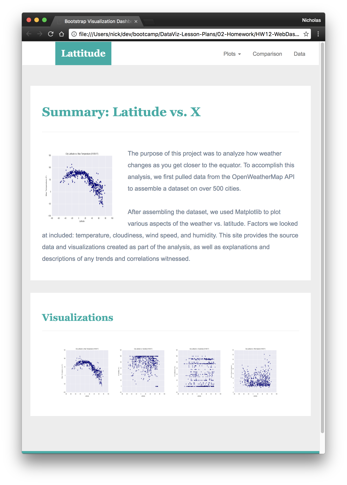
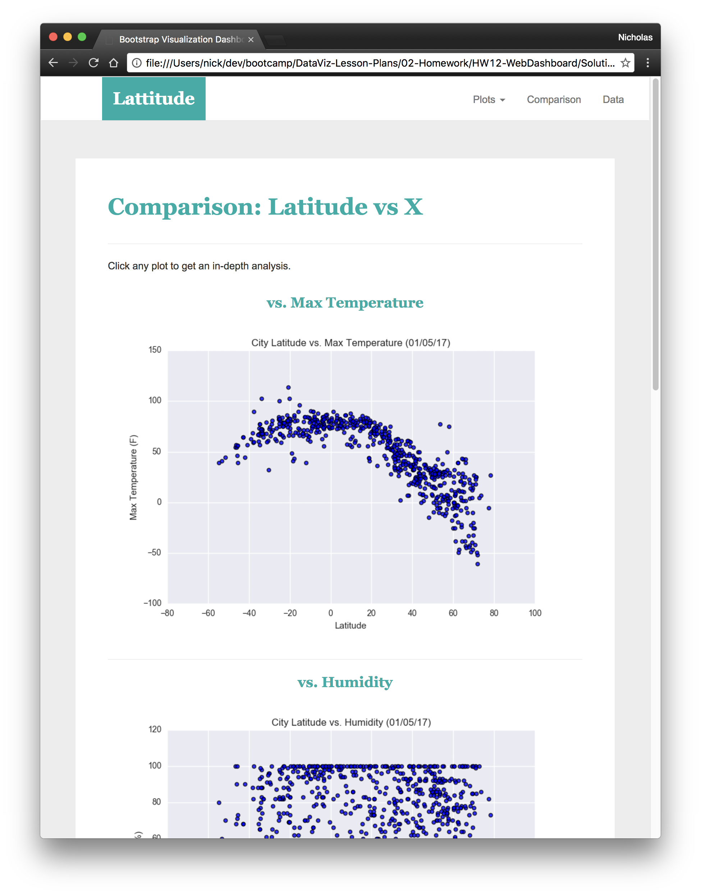

## Web Visualization Dashboard

## Background

The goal of this work include the use HTML and CSS technology to create a dashboard showing off the analysis done on wearther data scraped using weather API. Data on Temperature, humidity,cloudiness and wind speed as a function of cities (latitude and altitude) acoss the world was obtained through scraping openweathermap APIs.
Using proper labeling, matplotlib was used to plot graghs for each weather parameter in relation to latitude for various cities across the world with considered range
(Resources/assets/images/fig1)

## Latitude - Latitude Analysis Dashboard with Attitude
All plots from weather data was then used for the web visualisation part as a means to make the analysis sharable as can be seen on the landing page here

In building this dashboard, individual pages for each plot were created and a means to navigate between pages was designed. These pages contain the visualizations and their corresponding explanations. The dashboard include a landing page, a page where we can see a comparison of all of the plots, and another page where we can view the data used to build them.

For reference, see the ["Screenshots" section](#screenshots) below.

* A [landing page](#landing-page) containing:
  * An explanation of the project.
  * Links to each visualizations page.
* Four [visualization pages](#visualization-pages), each with:
  * A descriptive title and heading tag.
  * The plot/visualization itself for the selected comparison.
  * A paragraph describing the plot and its significance.
* A ["Comparisons" page](#comparisons-page) that:
  * Contains all of the visualizations on the same page so we can easily visually compare them.
  * Uses a bootstrap grid for the visualizations.
    * The grid must be two visualizations across on screens medium and larger, and 1 across on extra-small and small screens.
* A ["Data" page](#data-page) that:
  * Displays a responsive table containing the data used in the visualizations.
 

#### Landing page

Large screen:

Small screen:

?

#### Comparisons page

Large screen:

Small screen:

#### Data page

Large screen:

Small screen:

#### Visualization pages

You'll build four of these, one for each visualization. Here's an example of one:

Large screen:

Small screen:

#### Navigation menu

Large screen:

Small screen:

